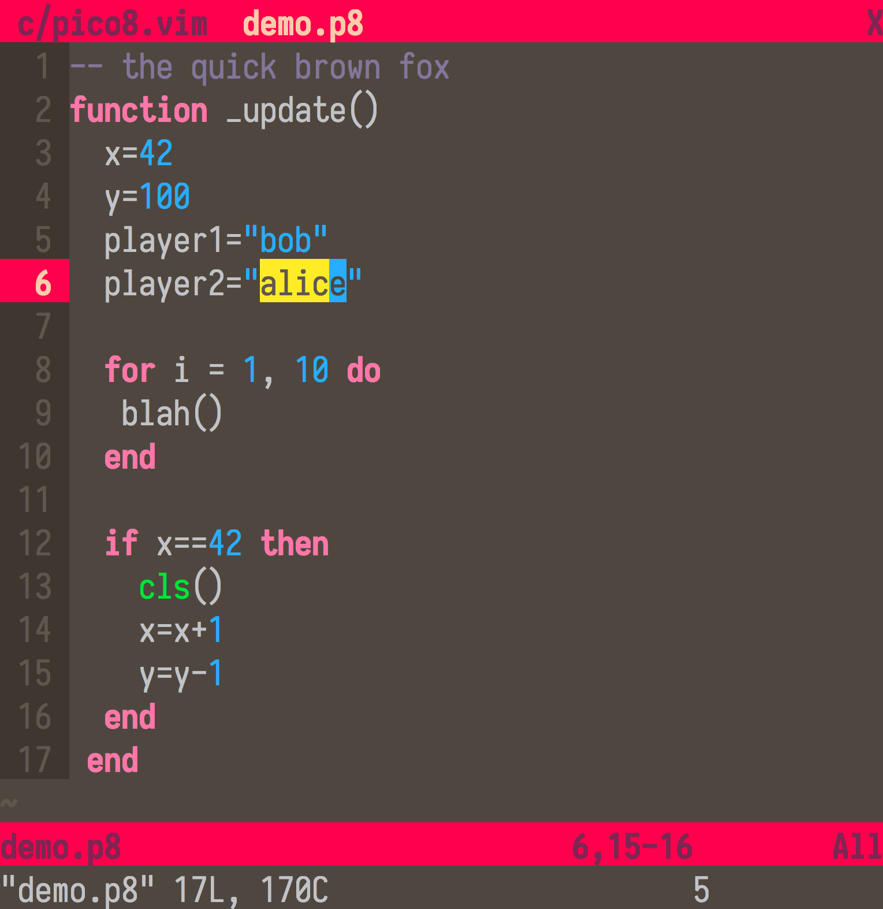
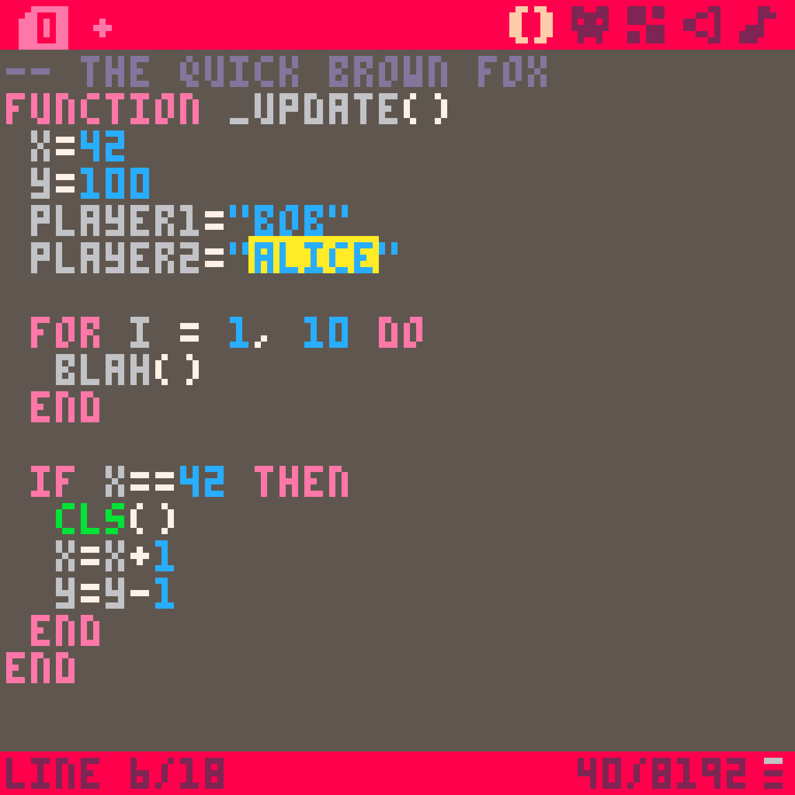

---

Vim color scheme inspired by the [PICO-8](https://www.lexaloffle.com/pico-8.php) fantasy console.

Currently only designed for Lua/PICO-8 files (colors don't look good with other languages and file types).

|                  Vim                  |                   PICO-8                   |
|:-------------------------------------:|:------------------------------------------:|
|  |  |

## Installation

Requires a terminal with true color support (or GVim/MacVim).

Using [vim-plug](https://github.com/junegunn/vim-plug):

```vim
Plug 'evanrelf/vim-pico8-color'
Plug 'ssteinbach/vim-pico8-syntax' " optional

set termguicolors
colorscheme pico8
```

## Related projects

This is a fork of [BordenJardine's](https://github.com/BordenJardine) color scheme [pico8-vim-colorscheme](https://github.com/BordenJardine/pico8-vim-colorscheme), but I have redone almost everything.

This color scheme works well with with:

- [ssteinbach/vim-pico8-syntax](https://github.com/ssteinbach/vim-pico8-syntax) - Syntax highlighting for PICO-8's `.p8` files
- [juanitogan/p8-programming-fonts](https://github.com/juanitogan/p8-programming-fonts) - Fonts modified for PICO-8 programming

Thanks to [Roman Zolotarev](https://www.romanzolotarev.com/) for his [PICO-8 Color Palette](https://www.romanzolotarev.com/pico-8-color-palette/), which was a useful reference when making this.

## License

[MIT](LICENSE)
